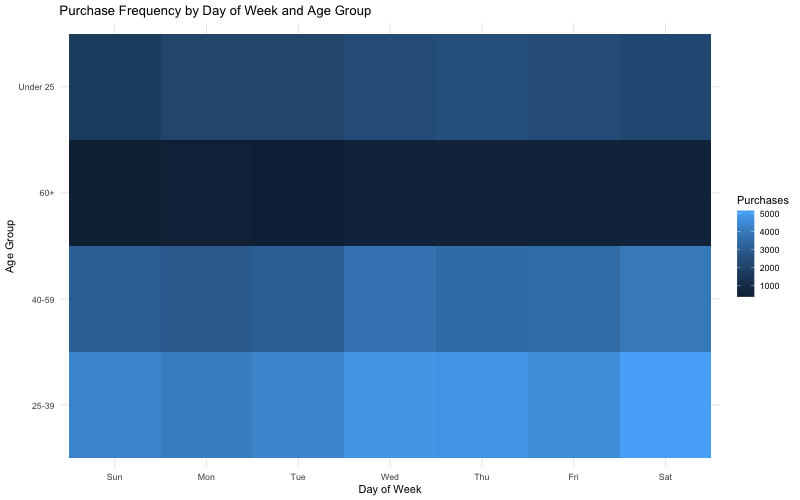
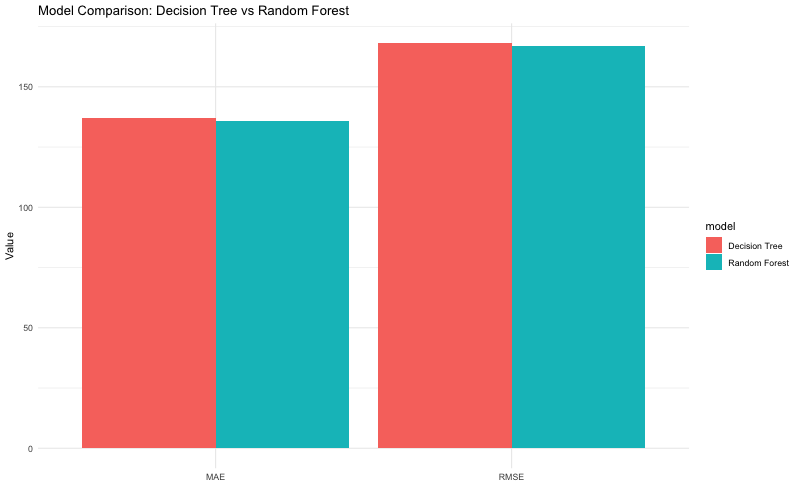
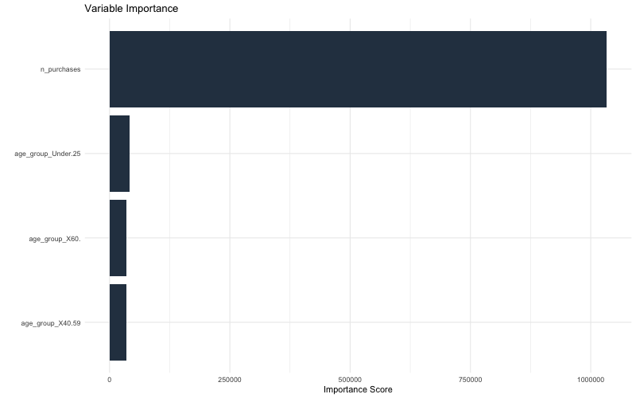

---
format:
  revealjs:
    theme:
      - simple
      - hm-style.scss
    title-slide: false
    transition: fade
    background-transition: fade
    slide-number: true
    controls: true
    progress: true
    center: false
    width: 1600
    height: 900
    margin: 0.06
execute:
  echo: false
  warning: false
  message: false
---

## {.cover-slide background-image="assets/why-topic-matters.png" background-size="cover" background-opacity="0.22"}

::: {.cover-panel}
{.hm-cover-logo}

::: {.cover-title}
H&M Customer Segmentation
:::

::: {.cover-members}
**Group Members:** Michelle Diaz · Frank Renn · Daisy Herandez · Rosarie Maramag · Gigi Brunel
:::
:::

## Problem Definition {background-image="assets/problem-definition.png" background-size="cover" background-opacity="0.18" .problem-slide}

::: {.content-panel}
**Audience:** H&M marketing, CRM, and merchandising teams.

**Problem:** H&M has a large transaction dataset, but raw purchase records do not directly explain which customers are most valuable, how they shop, or when they are most likely to buy.
 
**Project focus:** Use customer segmentation to turn transaction history into actionable marketing insights.
:::

## Research Objectives {background-image="assets/problem-definition.png" background-size="cover" background-opacity="0.18" .problem-slide}

::: {.content-panel .wide-panel}
| AO | Analytics Objective | Team Member |
|------------------------|------------------------|------------------------|
| AO1 | Do customers with different Fashion News subscription statuses exhibit different purchasing behavior? | Gigi |
| AO2 | Can spending behavior and age help explain which customers are more likely to leave the membership program? | Rosarie |
| AO3 | Does the sales channel (online vs. store) relate to spending patterns? | Michelle |
| AO4 | How can customers be segmented using RFM value? | Frank |
| AO5 | Do purchase timing patterns differ across customer segments? | Daisy |
:::

## Importance of the Topic {background-image="assets/importance-topic.png" background-size="cover" background-opacity="0.16" .importance-slide}

::: {.content-panel}
This project gives H&M a practical way to understand customers using real purchase data.

The findings can help the audience:

-   Target high-value customers more effectively
-   Re-engage inactive or low-frequency customers
-   Compare online and store behavior
-   Time campaigns based on segment-level purchase patterns
-   Support customer-focused decision making
:::

## Why This Topic Matters {background-image="assets/why-topic-matters.png" background-size="cover" background-opacity="0.18" .matters-slide}

::: {.content-panel}
Customer segmentation helps H&M move from broad marketing to more targeted decisions.

Instead of treating all shoppers the same, the team can identify groups such as high-value loyal customers, occasional buyers, inactive customers, and customers with specific timing or channel preferences.

This can support better promotions, retention strategies, product recommendations, and campaign timing.
:::

## Population {background-image="assets/importance-topic.png" background-size="cover" background-opacity="0.16"}

::: {.content-panel}
The population represented in this dataset is H&M's online and in-store customer base, captured through their purchase transaction history.

- Over 1.3 million unique customers
- Customer attributes include age, club membership status, and fashion news subscription preference
- Over 100,000 distinct products (articles), described by category, garment type, color, and department
- Transactions span both online and physical store sales channels
:::

## Sampling / Data Collection {background-image="assets/importance-topic.png" background-size="cover" background-opacity="0.16" .importance-slide}

::: {.content-panel}
**Source:** H&M Group, released publicly via a Kaggle competition (Personalized Fashion Recommendations).

**Original collection:** Real transaction records logged by H&M's retail systems across online and store sales channels.

**Our approach:** Given the full transaction file's size (over 31 million records), our group is working with a random sample of transactions, joined with the full customer and article metadata, to make analysis feasible while preserving the overall structure of customer behavior.
:::

## Data Wrangling {background-image="assets/importance-topic.png" background-size="cover" background-opacity="0.16" .importance-slide}

::: {.content-panel .panel-xs}
**From Records to Data**

- Raw data arrives as three separate files: customer metadata, product/article metadata, and transaction records
- Given the size of the full transaction file (31M+ records), our group works with a random sample of transactions, joined with the full customer and article tables
- Files are imported into R and inspected for structure, column types, and row counts before any cleaning begins

**Tidying the Data**

- Check each table for missing values (e.g., customer age, price) and decide on an appropriate handling approach (imputation, exclusion, or flagging)
- Standardize categorical variables (e.g., sales channel codes, membership status) to consistent, labeled categories
- Remove or address any duplicate records

**Transforming the Data**

- Join transaction data with customer and article metadata using customer_id and article_id as keys
- Create derived variables needed for specific RO's (e.g., total spend per customer, RFM scores, purchase date components)
- Aggregate transaction-level data to the customer level where needed for segmentation analysis
:::

## AO1: Predicting High-Spending Customers {background-image="assets/importance-topic.png" background-size="cover" background-opacity="0.16" .importance-slide}

::: {.content-panel .panel-xs}

**Analytics Objective:**  
Can customer characteristics and previous purchasing behavior predict whether an H&M customer will become a future high spender?

**Lead:** Gigi Brunel

**Machine Learning Methods**

- Lasso Logistic Regression
- Tuned Decision Tree
- Random Forest
- XGBoost

**Outcome:**  
High Spender · Not High Spender

**Business Goal:**  
Identify customers who are more likely to become high spenders so H&M can provide more relevant promotions and recommendations.

:::

## AO1: Data Wrangling & Model Setup {.dense-slide background-image="assets/importance-topic.png" background-size="cover" background-opacity="0.16" .importance-slide}


::: {.content-panel .panel-xs}

**Data Wrangling**

- Combined customer data with transaction history
- Used pre-July 2020 transactions as predictors
- Used later transactions to measure future spending
- Created customer-level purchasing features
- Defined High Spenders using median future spending
- Separated feature and outcome periods to prevent leakage

**Predictors**

- Fashion News status, age, club membership
- Prior transactions and total spending
- Average price and unique products
- Online purchase share
- Days since most recent purchase

**Model Setup**

- 80% training / 20% testing
- Stratified by High Spender status
- 10-fold cross-validation


:::

## AO1: Prediction & Model Evaluation {background-image="assets/importance-topic.png" background-size="cover" background-opacity="0.16"}

::: {.content-panel .panel-xs}

**10-Fold Cross-Validation**

| Model | Mean ROC AUC | Standard Error |
|---|---:|---:|
| **XGBoost** | **0.622** | 0.0027 |
| Lasso Logistic Regression | 0.620 | 0.0024 |
| Decision Tree | 0.613 | 0.0029 |
| Random Forest | 0.609 | 0.0022 |

**Best Model:** XGBoost

XGBoost achieved the highest ROC AUC, but its advantage over Lasso was only **0.002**, which was smaller than one standard error.

**Finding:** More model complexity provided only a small improvement over Logistic Regression.

:::


## AO1: Model Interpretation {background-image="assets/importance-topic.png" background-size="cover" background-opacity="0.16" .importance-slide .dense-slide}

::: {.content-panel .panel-xs}

**Variable Importance**

- **Prior total spending** was the strongest feature
- Online purchase share and age also contributed
- Purchasing behavior was more informative than demographics

**Partial Dependence**

- Higher prior spending generally increased High-Spender probability

**SHAP**

- Unknown Fashion News status and prior spending had the largest average effects
- "Unknown" represents missing information and should be interpreted carefully

:::


## AO1: Summary Findings {background-image="assets/importance-topic.png" background-size="cover" background-opacity="0.16" .importance-slide .dense-slide}

::: {.content-panel .panel-xs}

**Key Findings**

- **XGBoost:** highest CV ROC AUC (**0.622**)
- **Lasso:** nearly identical performance (**0.620**)
- **Prior total spending:** strongest XGBoost feature
- Higher prior spending generally increased High-Spender probability
- Purchasing behavior was more informative than Fashion News status

**Business Takeaway**

- Focus on **previous purchasing behavior**
- Prioritize stronger spenders for personalized marketing
- Use predictions as **decision support**, not perfect classifications

:::


## AO2: Predicting Membership Status from Spending and Age {background-image="assets/importance-topic.png" background-size="cover" background-opacity="0.16" .importance-slide}

::: {.content-panel .panel-small}

**Research Objective:** Can spending behavior and age help explain which customers are more likely to leave the membership program?

**Lead:** Rosarie Maramag

**ML Methods Used:** Classification-Focused Methods — Multinomial Logistic Regression (predicting a 3-category outcome: ACTIVE, PRE-CREATE, LEFT CLUB)

**IV's and DV's:** IV: `Total Spending`, `Purchase Frequency`, and `Age` (Continuous/Numerical)

DV: `Membership Status` (Categorical: ACTIVE, PRE-CREATE, LEFT CLUB)

:::

## AO2: Data Wrangling & Visualization {background-image="assets/importance-topic.png" background-size="cover" background-opacity="0.16" .importance-slide}

::: {.content-panel .panel-smaller}

**Data wrangling:** Linked customer records to transaction history using Customer IDs. Handled missing values in `Age` (~15,861 missing) and `Membership Status` (~6,062 missing). Since only 467 of 1.37M customers are LEFT CLUB (~0.03%), a simple random sample would have captured almost none of them — so a **stratified sample** was used instead: all available LEFT CLUB customers, plus a random sample of PRE-CREATE and ACTIVE customers, to ensure the rare class was represented. Aggregated total spend and purchase frequency per customer.

**Final sample:** 4,333 ACTIVE · 2,214 PRE-CREATE · 323 LEFT CLUB

**Data visualization:** A stacked bar chart showing the distribution of Membership Status across Age Brackets, and a box plot comparing total spending across membership groups.

:::

## AO2: Model Fitting {.dense-slide background-image="assets/importance-topic.png" background-size="cover" background-opacity="0.16" .importance-slide}

::: {.content-panel .panel-small}

**Data splitting:** 80/20 train-test split, stratified by membership status to preserve class proportions in both sets.

**Recipe:** Predictors (age, total spend, purchase frequency) were normalized (centered and scaled) before modeling.

**Model specification:** Multinomial logistic regression (`multinom_reg()` via the `nnet` engine), predicting membership status from age, total spend, and purchase frequency.

:::
```{r}
#| echo: true
#| eval: false

model_recipe <- recipe(membership_status ~ age + total_spend + purchase_freq,
                        data = customer_data) %>%
  step_normalize(all_numeric_predictors())

model_spec <- multinom_reg() %>%
  set_engine("nnet") %>%
  set_mode("classification")

data_split <- initial_split(customer_data, prop = 0.8, strata = membership_status)
train_data <- training(data_split)
test_data  <- testing(data_split)

final_model <- workflow() %>%
  add_recipe(model_recipe) %>%
  add_model(model_spec) %>%
  fit(data = train_data)
```

## AO2: Prediction and Model Evaluation {background-image="assets/importance-topic.png" background-size="cover" background-opacity="0.16" .importance-slide}

::: {.content-panel .panel-small}

The model was evaluated on the held-out 20% test set.

**Accuracy: 65.5%** — the model correctly classified a customer's membership status about two-thirds of the time.

**Kappa: 0.158** — a low-to-moderate score, indicating the model performs only somewhat better than chance once class imbalance is accounted for. This reflects how difficult it genuinely is to predict a rare outcome like leaving the club from just three variables.

:::

## AO2: Interpretation {background-image="assets/importance-topic.png" background-size="cover" background-opacity="0.16" .importance-slide}

::: {.content-panel .panel-small}

Coefficients show how each variable shifts the odds of a customer's status relative to ACTIVE members:

- **Purchase frequency** was negatively associated with both PRE-CREATE and LEFT CLUB status — customers who purchase less often are more likely to fall into either non-active group.
- **Total spending** was positively associated with LEFT CLUB status — surprisingly, higher total spending did not clearly predict staying active.
- **Age** had the smallest effect of the three predictors on LEFT CLUB status.

This suggests **how often** a customer buys may be a stronger signal of disengagement than **how much** they've spent historically.

:::

## AO2: Summary Findings {background-image="assets/importance-topic.png" background-size="cover" background-opacity="0.16" .importance-slide}

::: {.content-panel .panel-small}

Spending behavior and age can partially explain membership status, but the relationship is more nuanced than expected. Purchase **frequency**, not total spend, was the more consistent signal of disengagement — challenging the common assumption that active members are simply defined by how much they spend.

The model's moderate accuracy (65.5%) and low Kappa (0.158) suggest membership status is difficult to predict from these three variables alone, and that behavioral factors beyond spending and age (e.g., recency of last purchase, channel preference) may better explain why customers leave.

**Business takeaway:** H&M's retention efforts may benefit more from monitoring *purchase frequency trends* per customer than from spending thresholds alone.

:::

## RO3: Sales Channel and Spending {background-image="assets/importance-topic.png" background-size="cover" background-opacity="0.16" .importance-slide}

::: {.content-panel .panel-small}
**Research Objective:** Does the sales channel (online vs. store) relate to spending patterns?  
**Lead:** Michelle Diaz

**IV's and DV's:**  
IV: Sales channel (online vs. store)  
DV: Price / basket size (spend per transaction or per customer)

**Plan for data wrangling:**  
Join transaction-level data with customer and article metadata as needed, confirm sales_channel_id is correctly coded, aggregate price to customer-level spend, and check for missing or invalid values.

**Plan for data visualization:**  
Boxplot or violin plot comparing price distribution across channels, and a bar chart comparing average spend per customer by channel.
:::

## RO3: Sales Channel and Spending -- ML Method {background-image="assets/importance-topic.png" background-size="cover" background-opacity="0.16" .importance-slide}

::: {.content-panel .panel-small}
**Method used:** Regression tree (CART), with bagged tree and random forest as comparison ensembles

**Why regression, not classification:** DV (price / spend) is continuous, not a category

**Why a tree-based method:** Allows non-linear splits and interactions between channel, product group, age, membership status, and news subscription without assuming a linear relationship
:::

## RO3: Model Fitting {.dense-slide background-image="assets/importance-topic.png" background-size="cover" background-opacity="0.16" .importance-slide}

::: {.content-panel .panel-small}
**Data:** ~75,000 row sample of H&M transactions, joined to customer and article metadata

**Split:** 75% train / 25% test, stratified by price

**Recipe:** price ~ sales_channel_id + age + club_member_status + fashion_news_frequency + product_group_name

**Model spec:** Decision tree (rpart engine), compared against bagged tree and random forest (ranger engine), evaluated with 10-fold cross-validation
:::

```{r}
#| echo: false
#| message: false

library(tidymodels)
# library(rpart.plot)  # not installed, causes render to fail
# library(vip)          # not available for this R version
```

```{r}
#| echo: true
#| eval: false

hm_split <- initial_split(hm_sample, prop = 0.75, strata = price)
hm_train <- training(hm_split)
hm_test  <- testing(hm_split)

hm_recipe <- recipe(price ~ sales_channel_id + age + club_member_status +
                       fashion_news_frequency + product_group_name,
                     data = hm_train)

tree_spec <- decision_tree() |>
  set_engine("rpart") |>
  set_mode("regression")

tree_fit <- workflow() |>
  add_recipe(hm_recipe) |>
  add_model(tree_spec) |>
  fit(data = hm_train)
```

## RO3: Prediction and Model Evaluation {background-image="assets/importance-topic.png" background-size="cover" background-opacity="0.16" .importance-slide}

::: {.content-panel .panel-small}
**Test set performance:**

RMSE = 0.0179
R-squared = 0.0884

**What this means:** The model explains only about 9% of the variation in price. Channel, age, product group, and membership status together are weak predictors of spend, most of the variation comes from factors not captured in this data.
:::

```{r}
#| echo: true
#| eval: false

tree_preds <- predict(tree_fit, hm_test) |>
  bind_cols(hm_test)

tree_preds |>
  metrics(truth = price, estimate = .pred)
```

## RO3: Interpretation {background-image="assets/importance-topic.png" background-size="cover" background-opacity="0.16" .importance-slide}

::: {.content-panel .panel-small}
**Single tree:** Splits entirely on product_group_name. Sales channel is never chosen as a splitting variable.

**Random forest variable importance:** product_group_name is by far the strongest predictor. sales_channel_id ranks second, well behind product group. age, fashion_news_frequency, and club_member_status contribute very little.
:::

```{r}
#| echo: true
#| eval: false

rpart.plot(tree_fit$fit$fit$fit)
```

```{r}
#| echo: true
#| eval: false

rf_spec <- rand_forest() |>
  set_engine("ranger", importance = "impurity") |>
  set_mode("regression")

rf_fit <- workflow() |>
  add_recipe(hm_recipe) |>
  add_model(rf_spec) |>
  fit(data = hm_train)

rf_fit |>
  extract_fit_parsnip() |>
  vip::vip()
```

## RO3: Summary Findings {background-image="assets/importance-topic.png" background-size="cover" background-opacity="0.16" .importance-slide}

::: {.content-panel .panel-small}
**Does sales channel relate to spending? Not meaningfully.**

The regression tree split entirely on product group, never on sales channel. The random forest ranked sales channel second in importance, but far behind product group.

**What actually drives spend:** What a customer buys (product group) matters far more than where they buy it (online vs. in store).

**Caveat:** Overall model performance is weak (R-squared = 0.0884), so even product group alone does not strongly predict price. Spend is likely driven by factors outside this dataset, such as promotions, loyalty behavior, or individual preference.
:::

## AO4: Predicting Future RFM Value {background-image="assets/importance-topic.png" background-size="cover" background-opacity="0.16" .importance-slide}

::: {.content-panel .panel-small}

**Research Objective:**  
Can historical customer behavior predict a customer's future RFM value?

**Lead:** Frank Renn

**Machine Learning Methods**

- Classification Tree
- Bagged Trees
- Random Forest
- Boosted Tree

**Outcome:**  
Inactive · Low Value · Mid Value · High Value

**Business Goal:**  
Identify customers for retention, growth, and reactivation campaigns.

:::


## AO4: Data Wrangling & Visualization {.importance-slide .dense-slide background-image="assets/importance-topic.png" background-size="cover" background-opacity="0.16"}

::: {.content-panel}

### Data Wrangling

- Aggregated transactions to the **customer level**
- Created historical **Recency, Frequency, and Monetary** measures
- Added average price, number of items, online share, active months, and purchase span
- Joined age, membership status, and fashion-news variables
- Used future purchasing behavior to create the target RFM class

### Time Periods

**Historical Features:** Jun 2019 – May 2020  
**Future Outcome:** Jun 2020 onward

### Visualization Finding

Frequency and monetary behavior showed substantial overlap across future RFM groups, indicating that the four customer classes would not be perfectly separable.

:::


## AO4: Model Fitting {.importance-slide .dense-slide background-image="assets/importance-topic.png" background-size="cover" background-opacity="0.16"}

::: {.content-panel}

### Data Splitting

- **80% training / 20% testing**
- Stratified by future RFM class
- Up to **1,500 customers per class**
- Approximately balanced four-class sample

### Recipe Creation

- Median imputation for missing numeric predictors
- Unknown and new categorical levels handled
- Zero-variance predictors removed
- One-hot encoding applied for XGBoost

### Model Specification

| Model | Approach |
|---|---|
| Classification Tree | Single interpretable tree |
| Bagged Trees | Multiple bootstrap trees |
| Random Forest | Bagging + random predictor selection |
| Boosted Tree | Sequential error-correcting trees |

**Validation:** 10-fold stratified cross-validation

:::


## AO4: Prediction & Model Evaluation {.importance-slide .dense-slide background-image="assets/importance-topic.png" background-size="cover" background-opacity="0.16"}

::: {.content-panel}

### Classification Tree — Test Set

| Metric | Result |
|---|---:|
| Accuracy | **41.1%** |
| Macro Sensitivity | **41.1%** |
| Macro Specificity | **80.4%** |
| Multiclass ROC AUC | **0.673** |

With four balanced classes, random guessing would produce approximately **25% accuracy**.

### Cross-Validated Model Comparison

| Model | Result |
|---|---|
| **Boosted Tree** | **42.4% Accuracy / 0.695 AUC** |
| Classification Tree | 41.7% Accuracy / 0.674 AUC |
| Random Forest | 0.687 AUC |
| Bagged Trees | Evaluated on same CV folds |

**Best Model:** **Boosted Tree**

:::


## AO4: Interpretation {.importance-slide .dense-slide background-image="assets/importance-topic.png" background-size="cover" background-opacity="0.16"}

::: {.content-panel}

### Recall by Customer Segment

| Segment | Recall |
|---|---:|
| **Inactive** | **62.7%** |
| **High Value** | **52.0%** |
| Low Value | 27.7% |
| Mid Value | 22.0% |

### Interpretation

- **Inactive** customers were easiest to identify
- **High Value** customers were also predicted relatively well
- Mid and Low Value customers had more overlapping historical behavior
- Extreme customer groups were easier to distinguish than middle-value groups
- Random Forest **permutation importance** was used to identify influential predictors
- Historical purchasing behavior provided stronger predictive information than profile variables alone

:::


## AO4: Tree Complexity & Pruning {.importance-slide .dense-slide background-image="assets/importance-topic.png" background-size="cover" background-opacity="0.16"}

::: {.content-panel}

### Overfitted Tree

**Cost Complexity: `cp = 0.0001`**

| Metric | Result |
|---|---:|
| Training AUC | **1.00** |
| Testing AUC | ~**0.55** |

The large gap shows severe **overfitting**.

### Best Pruning Level

**Cost Complexity: `cp ≈ 0.001`**

- Testing AUC: ~**0.68**
- Final tree: **55 leaf nodes**

**Finding:**  
Moderate pruning improved generalization by reducing unnecessary model complexity.

:::


## AO4: Summary Findings {.importance-slide .dense-slide background-image="assets/importance-topic.png" background-size="cover" background-opacity="0.16"}

::: {.content-panel}

### Key Findings

- Historical customer behavior provided a **moderate signal** of future RFM value
- Classification Tree achieved **41.1% test accuracy / 0.673 AUC**
- Boosted Tree performed best with **42.4% CV accuracy / 0.695 AUC**
- Inactive customers had the highest recall at **62.7%**
- High Value customers achieved **52.0% recall**
- Mid Value customers were hardest to identify at **22.0% recall**
- Moderate pruning reduced overfitting and improved generalization

### Business Takeaway

**High Value** → Loyalty & retention  
**Mid / Low Value** → Engagement & growth  
**Inactive** → Reactivation & win-back

Predicted RFM value can help H&M prioritize customer targeting, but the model should be used as a **decision-support tool rather than a perfect classification system**.

:::

## RO5: Purchase Timing Patterns Across Segments {background-image="assets/importance-topic.png" background-size="cover" background-opacity="0.16" .importance-slide}

::: {.content-panel .panel-small}
**Research Objective:** Do purchase timing patterns differ across customer segments?  
**Lead:** Daisy Hernandez

**IV's and DV's:**  
IV: Customer segment (e.g., RFM group or demographic segment)  
DV: Purchase timing (day of week, month/season, time between purchases)

**Plan for data wrangling:**  
Extract date components (day of week, month, season) from transaction timestamps, join transactions with customer segment labels, and aggregate purchase counts and average time-between-purchases by segment and time period.

**Plan for data visualization:**  
A heatmap of purchase frequency by day of week and segment, and a line chart showing purchase volume trends over time (by month/season) across customer segments.
:::

## AO5: Purchase Timing -- ML Method {background-image="assets/importance-topic.png" background-size="cover" background-opacity="0.16" .importance-slide}

::: {.content-panel .panel-small}
**Method used:** Regression tree (rpart), with random forest (ranger) as a comparison ensemble

**Why regression, not classification:** DV (average days between purchases) is continuous, not a category

**Why this approach:**

- Compares a simple, interpretable single tree against an ensemble method
- Tests whether purchase count and age group can predict timing patterns
:::

## AO5: Data Wrangling & Visualization {.dense-slide background-image="assets/importance-topic.png" background-size="cover" background-opacity="0.16" .importance-slide}

::: {.content-panel .panel-small}
**Data:** A 75,000-row sample of H&M transactions, joined with customer metadata

**Wrangling steps:**

- Calculated the time gap between each customer's consecutive purchases
- Aggregated to average days between purchases per customer
- Filtered to customers with more than one purchase
- Joined with age group segments (Under 25, 25-39, 40-59, 60+)

**Visualization finding:** A heatmap of purchase frequency by day of week and age group shows the 60+ age group purchasing noticeably more often than other segments, fairly consistently across all days of the week.
:::



## AO5: Model Fitting {background-image="assets/importance-topic.png" background-size="cover" background-opacity="0.16" .importance-slide}

::: {.content-panel .panel-small}
**Data splitting:** 75% train / 25% test, stratified by average days between purchases

**Recipe:** avg_days_between_purchases ~ age_group + n_purchases

**Model spec:**

- Decision tree (rpart engine)
- Compared against random forest (ranger engine)
:::

## AO5: Prediction and Model Evaluation {.dense-slide background-image="assets/importance-topic.png" background-size="cover" background-opacity="0.16" .importance-slide}

::: {.content-panel .panel-small}
**Random forest test set performance:**

- RMSE = 167
- R-squared = 0.0135
- MAE = 136

**What this means:** The model explains only about 1.3% of the variation in average time between purchases, most of the variation comes from factors not captured in this data.
:::



## AO5: Interpretation {.dense-slide background-image="assets/importance-topic.png" background-size="cover" background-opacity="0.16" .importance-slide}

::: {.content-panel .panel-small}
**Purchase count (n_purchases):** Overwhelmingly the strongest predictor, roughly 25 to 30 times higher importance than any age group category

**Age group:** Contributed very little across all four brackets, similarly low importance throughout

**Takeaway:** How often a customer has purchased matters far more than their age when predicting time between purchases
:::



## AO5: Summary Findings {background-image="assets/importance-topic.png" background-size="cover" background-opacity="0.16" .importance-slide}

::: {.content-panel .panel-small}
**Do purchase timing patterns differ across customer segments? Not by age, meaningfully.**

- Random forest explained only 1.3% of the variation in time between purchases
- Purchase count dominated the model
- Age group added almost nothing

**Business takeaway:** H&M's timing-based campaigns are better targeted using a customer's purchase history rather than their age bracket. Age alone is not a useful segment for timing predictions.
:::

## Appendix {.dense-slide background-image="assets/importance-topic.png" background-size="cover" background-opacity="0.16" .importance-slide}

::: {.content-panel .panel-small}

### Project Resources 

**GitHub Repository**  
[View Group Project Repository](https://github.com/MichelleeeDiazzz/IBM-6540-Group-Project-)

**Presentation Slides**  


### Deployed Machine Learning Model

**H&M High-Spender Predictor — Gigi Brunel**

[Open Interactive XGBoost Prediction Dashboard](https://qnca96-gigi-brunel.shinyapps.io/hm-high-spender-predictor/)

**Purpose:** Enter different customer characteristics to estimate the probability that an H&M customer will become a future high spender.

**Membership Status Predictor — Rosarie Maramag**

[Open Interactive Membership Status Prediction Dashboard](https://rmaramag.shinyapps.io/membership-shiny-app/)

**Purpose:** Enter a customer's age, total spending, and purchase frequency to see the predicted membership status (Active, Pre-Create, or Left Club) and the model's confidence in each outcome.  
  

**H&M RFM Customer Value Predictor — Frank Renn**  
[Open Future Customer Value Predictor](https://f6hfd0-frank-renn.shinyapps.io/hm-rfm-predictor/)  
**Purpose:** Enter a customer's recency, frequency, monetary, to predict the value of customers.

:::


